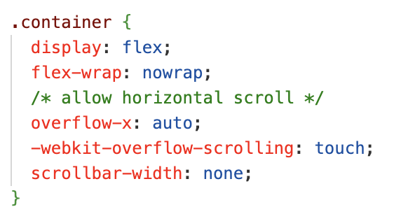
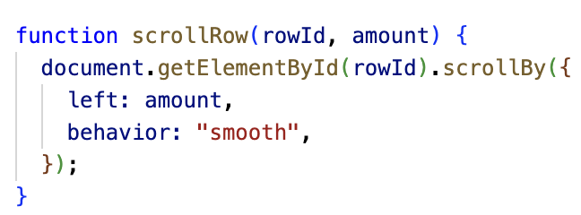
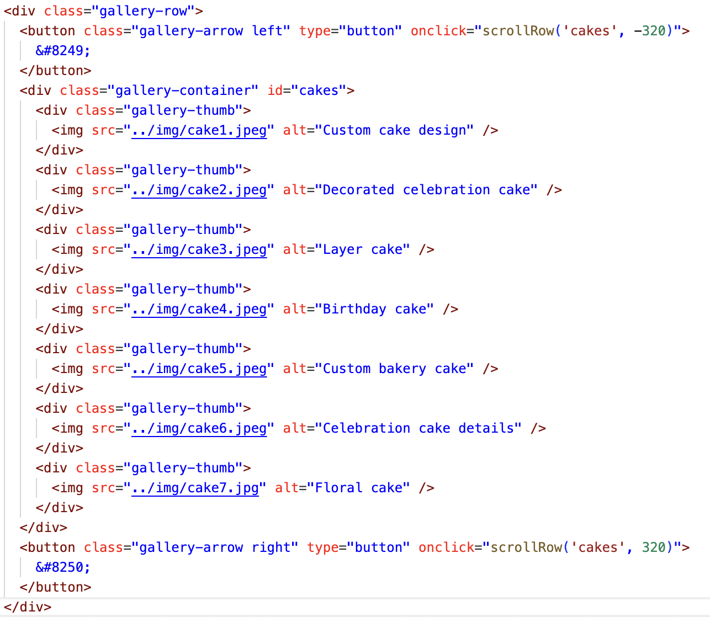

# Midterm Proposal Presentation

## Project Overview

I made a website for my small baking business for people to view my work, contact me, and place orders.

## Code Snippet

Something I learned to do while working on this assignment was horizontal scroll as seen in the photos below. It only requires two lines of code. However, I also added "scrollbar-width: none" which gets rid of the scrollbar beneath.

Another thing I learned was how to add arrows to the horizontal scroll gallery. I used a function at the top (as I did to toggle the hamburger menu) and then added buttons and called that function on click.

## What's Next?

Something I would like to add is the ability to click on each photo in the gallery to see a detailed description of each dessert. I would also like to make the horizontal scroll continuous/infinite. I also might want to make the order form even more detailed or possibly create separate order forms for different types of desserts.
